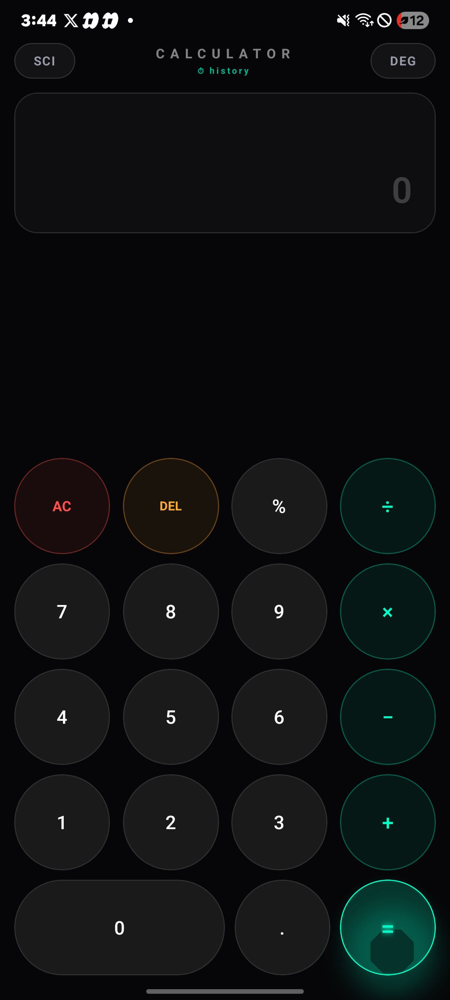
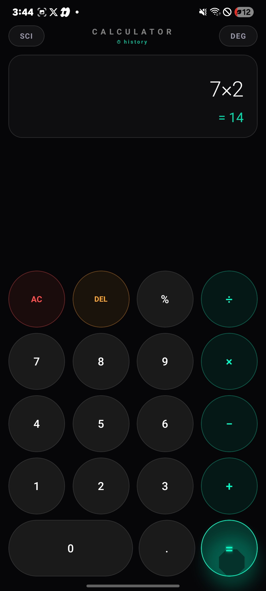
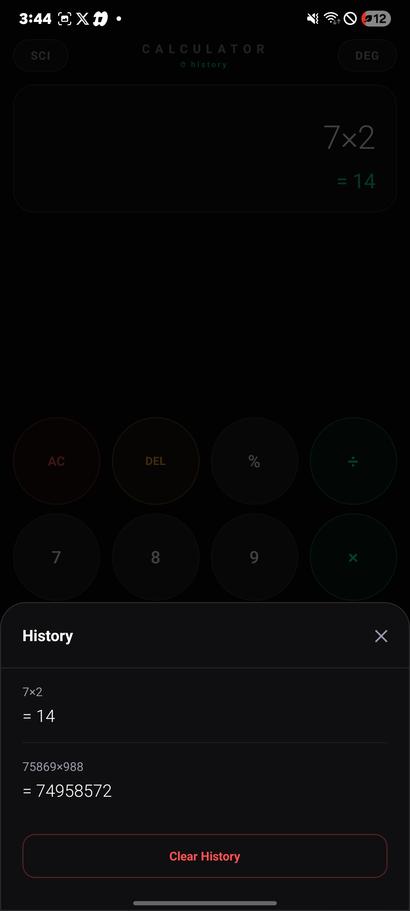
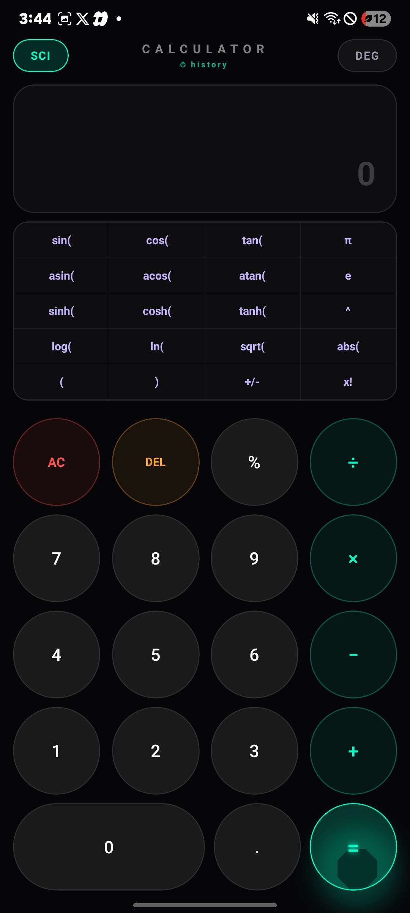

# Calculator-SEN216
A cross-platform Scientific Calculator built with React Native and Expo. This project demonstrates modern mobile application development practices, featuring a clean user interface and support for both basic and scientific mathematical operations.

## Features
Basic arithmetic operations
Scientific calculations
Clean and responsive UI
Cross-platform support (Android & iOS)
Built with React Native and Expo

## Screenshots

<p float="left">
  
  
  
  
</p>

## Tech Stack
React Native
Expo
JavaScript
Expo Go

## Installation

You can install and test the latest build using Expo:

Expo Build:
https://expo.dev/accounts/oxtomiwa_dev/projects/ScientificCalculator/builds/aff56da3-8977-4316-be25-e4665625c2ad

*Note: You may need the Expo Go app (or an Android device/emulator compatible with the build) to install and run the application.*

## Running Locally

Clone the repository
```bash
git clone https://github.com/adetomiwa08/Calculator-SEN216.git
```
Install dependencies
```bash
npm install
```
Start the Expo development server
```bash
npx expo start
```
Scan the QR code with the Expo Go app or run the project on an emulator.

